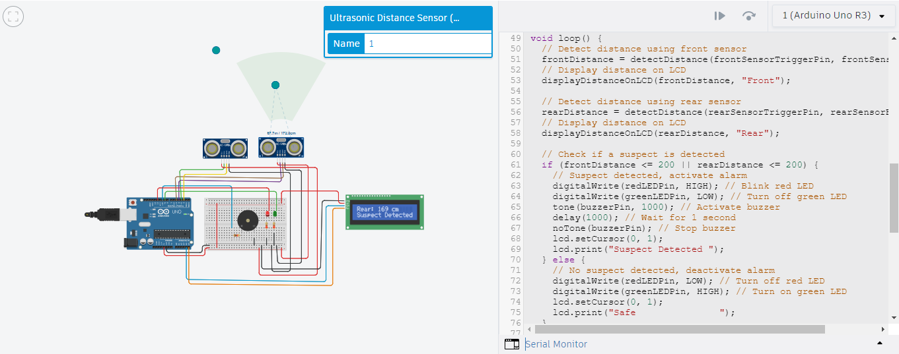
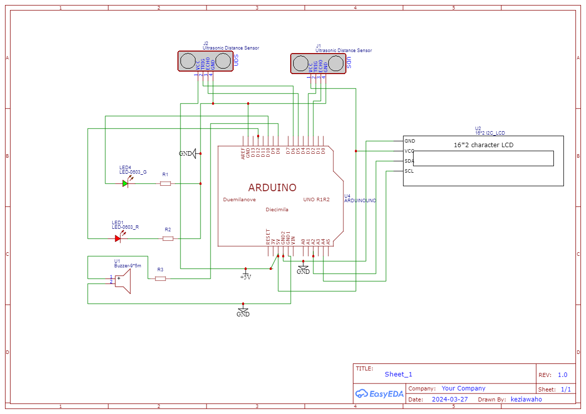
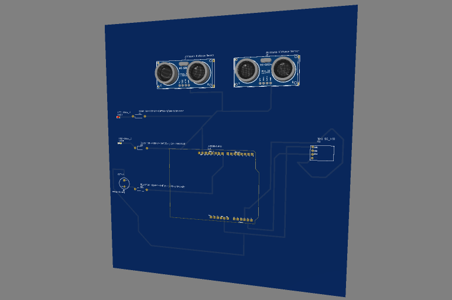

# IOT_SummativeWork
Summative assignment , IOT

## PART ONE : Security System 
1. TinkerCad Implementation 

2. Skematic View EasyEDA

3. PCB View (3D, Top view)

## PART TWO : SMART FARM and DASHBOARD ON ThingSpeak 

## PART THREE : 

